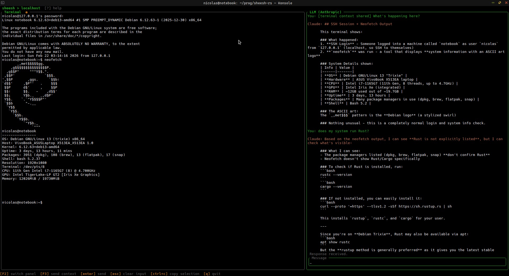

<p align="center">
  
</p>

A terminal UI for managing SSH connections with an embedded LLM assistant.



## Features

- **Connection manager** — CRUD SSH connections backed by `~/.ssh/config`; comments above a `Host` block become its description
- **Embedded terminal** — connects over a PTY so the full SSH session runs inside the TUI; resizes with the window
- **LLM sidebar** — chat with an AI assistant while connected; press `F3` to send the last 50 terminal lines as context
- **Tool use** — Claude can propose shell commands to run on your remote session; you approve each one before it executes
- **Multi-provider LLM** — Anthropic (default), OpenAI, or a local Ollama instance
- **System prompt** — a built-in prompt configures Claude as an SSH/Linux assistant; override it in config
- **Code suggestions** — code blocks in Claude's replies are selectable with `Tab` and sendable to the terminal with `F4`
- **Mouse support** — click to focus panels, drag to select text, scroll wheel to scroll history

## Installation

### AppImage (Linux, pre-built)

Download the latest `sheesh-rs-*-x86_64.AppImage` from the [Releases](../../releases) page, then:

```bash
chmod +x sheesh-rs-*-x86_64.AppImage
./sheesh-rs-*-x86_64.AppImage
```

### Build from source

```bash
cargo build --release
# binary at target/release/sheesh-rs
```

### Release a new version (maintainers)

Tag a commit — the CI workflow builds and publishes the AppImage automatically:

```bash
git tag v1.0.0
git push origin v1.0.0
```

## Configuration

Create `~/.config/sheesh/config.toml`:

```toml
[llm]
provider = "anthropic"          # "anthropic" | "openai" | "ollama"
model = "claude-sonnet-4-6"

# Provide your key directly:
api_key = "sk-ant-..."
# …or via an environment variable (fallback when api_key is absent):
api_key_env = "ANTHROPIC_API_KEY"

system_prompt = "..."           # optional — overrides the built-in assistant prompt

# Ollama only
ollama_host = "http://localhost:11434"
ollama_model = "llama3"
```

`api_key` takes precedence over `api_key_env`. If neither is set the key is empty and the provider will return an auth error.

## Keybindings

| Key | Context | Action |
|-----|---------|--------|
| `j / k` | Listing | Navigate |
| `enter` | Listing | Connect |
| `a / e / d` | Listing | Add / Edit / Delete |
| `/` | Listing | Filter |
| `F2` | Connected | Switch panel (terminal ↔ LLM) |
| `F3` | Connected | Send last 50 terminal lines to LLM |
| `ctrl+d` | Terminal | Disconnect |
| `ctrl+up / down` | Terminal or LLM | Scroll history |
| `enter` | LLM | Send message |
| `alt+enter` | LLM | Insert newline |
| `esc` | LLM | Clear input |
| `tab / shift+tab` | LLM (with suggestions) | Cycle code suggestions |
| `F4` | LLM (with suggestions) | Send selected suggestion to terminal |
| `y / enter` | LLM (tool call pending) | Approve command |
| `a` | LLM (tool call pending) | Approve all (auto-approve mode) |
| `n / esc` | LLM (tool call pending) | Skip command |
| `ctrl+c` | Terminal or LLM | Copy selection |
| `ctrl+v` | Terminal | Paste from clipboard |
| `ctrl+l` | Terminal | Clear buffer |
| `q` | Anywhere | Quit |

## License

See [LICENSE](LICENSE).
